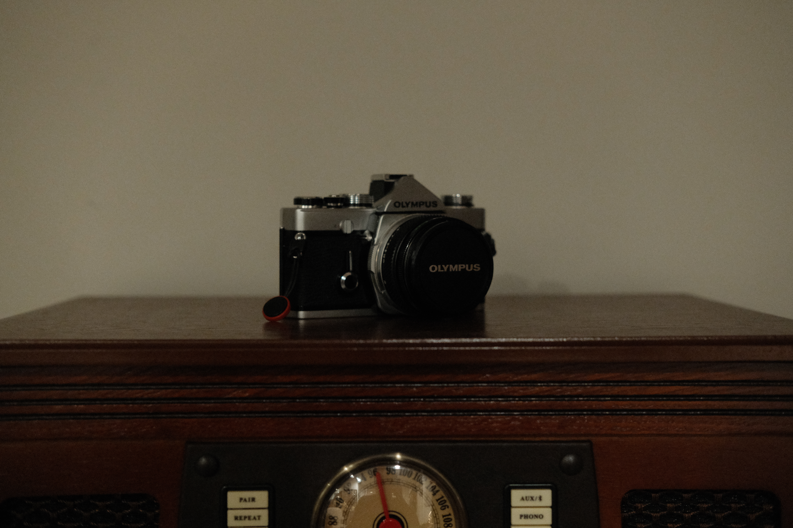
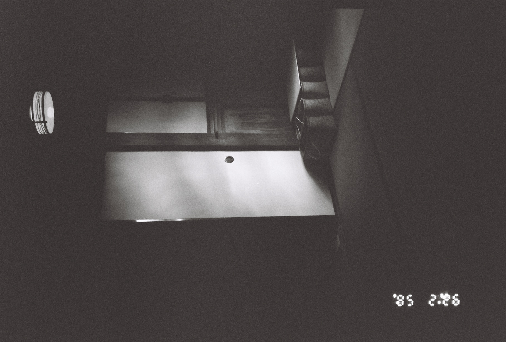
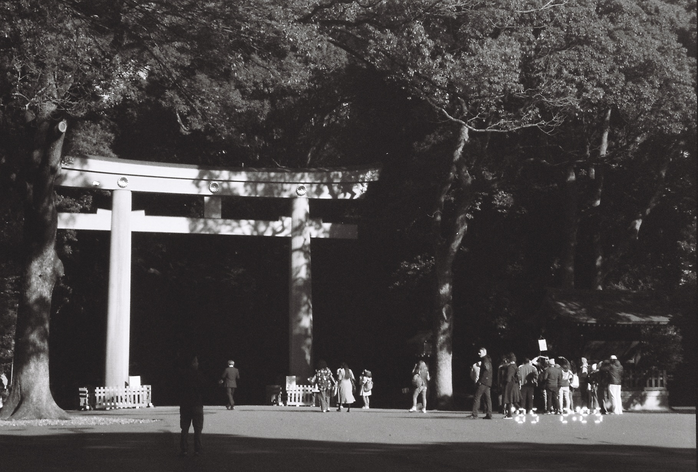
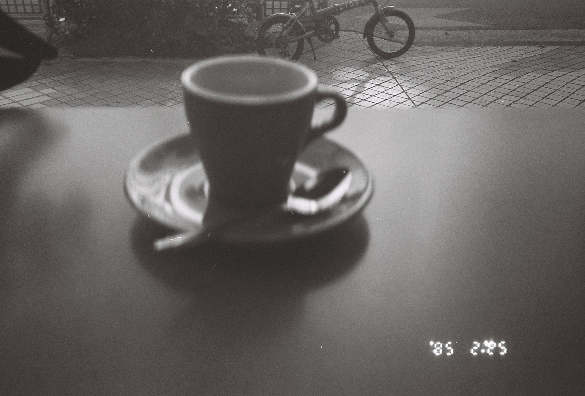

+++
date = '2025-11-02T22:10:55-05:00'
draft = false
title = 'Olympus'
+++

## A New Addition

I bit the bullet on an Olympus OM-1 this week. I snagged it from District Camera after some prodding from Goose and it's a purchase I don't think I'll soon regret. I'm eager to get shooting with it, and I keep think of places I could go that might be good studies for a roll of film.

When Zoe and I went to Japan last year, I took photos on a Leica ZX-2. As you can see from the photos below, the quality you get out of that simple point and shoot runs the gamut.

_A shot into a recreation of a 18th or 19th century Japanese home_

_The Meiji Jingu Ichino Torii in Tokyo_

_An attempt to capture a delicious espresso in Monzen-nakacho_

I could see that sometimes I was getting crisp clarity, and other times I was geting blurry shots, weird blown out highlights, or grainy dark images. I think especially this roll of Ilford HP5 was really beautiful film compared to the Kodak color rolls I also shot. Those turned out largely _meh_ in my eyes. The thing I didn't understand was why I got the results I did, even the good ones! What was happening in this camera that dictated the quality of my photographs.

I endeavored to find out and started looking online to see what camera I should get if I wanted to understand exposure. I combed Reddit for guidance and left with a list of cameras that would suit a novice like me. I started a list in my phone, and the Olympus OM-1 sat smack in the middle of that list.

Some context about Japan, but really Tokyo: they understand hobbies. Pen shops, knife shops, fashion boutiques, anime stores. There's a cute little store for every special interest, but the places I found so enticing were the camera shops. There are many used camera shops in Tokyo, and I was making it my missions to buy a nice film camera from one.

Finally, Zoe and I got into one of these shops (I believe it was Lemon-sha Shinjuku, which sat on the walk from our hotel to downtown Shinjuku), and I started to browse. I approached a clerk, because I new I needed help, and I sort of frantically spew word vomit that contained phrases akin to, "I'm just looking for like a manual film camera that is more advanced than my point and shoot." My pleas for help were met with somewhat blank stares, and the poor shopkeeps tried to understand rambling in a language they didn't fully have a grip on. I realized I didn't have a clue what I was talking about and I needed more time.

I went back to the U.S. empty handed, but immediately started to talk to Goose about what I should be looking for in a camera. At this point, I'd decided that I needed something digital, but with more control than the point and clicks we wielded as kids. He pointed me towards the Fujifilm X series, and I got one! The Fujifilm XT-30. This year I've taken loads of photos with it that I'll be sure to post in future blogs, and I've totally changed my understanding of what it means to have control over how light enters your lens.

I've recently finally started to take some photos I'm really proud of, and Zoe even printed one I took in Ireland to hang in our apartment.

And so last week, I suddenly chose to search the used gear page on the District Camera website and laid my eyes on an affordable, pristine Olympus OM-1.

I can't wait to shoot a roll on this thing and likely be humbled for thinking I was ready to wield a camera that really doesn't hold your hand at all. Even with my Fujifilm, you still have autofocus, and the option to let the camera pick your exposure settings. The OM-1 is a whole new beast that will require me to use a light meter, and understand what scenes call for what settings. It's a bit daunting!

I'm sure it will be a blast.

-C
