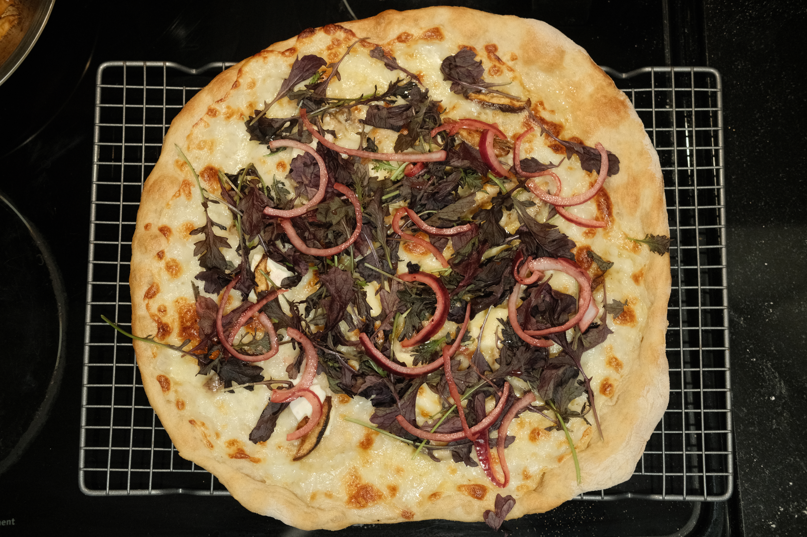
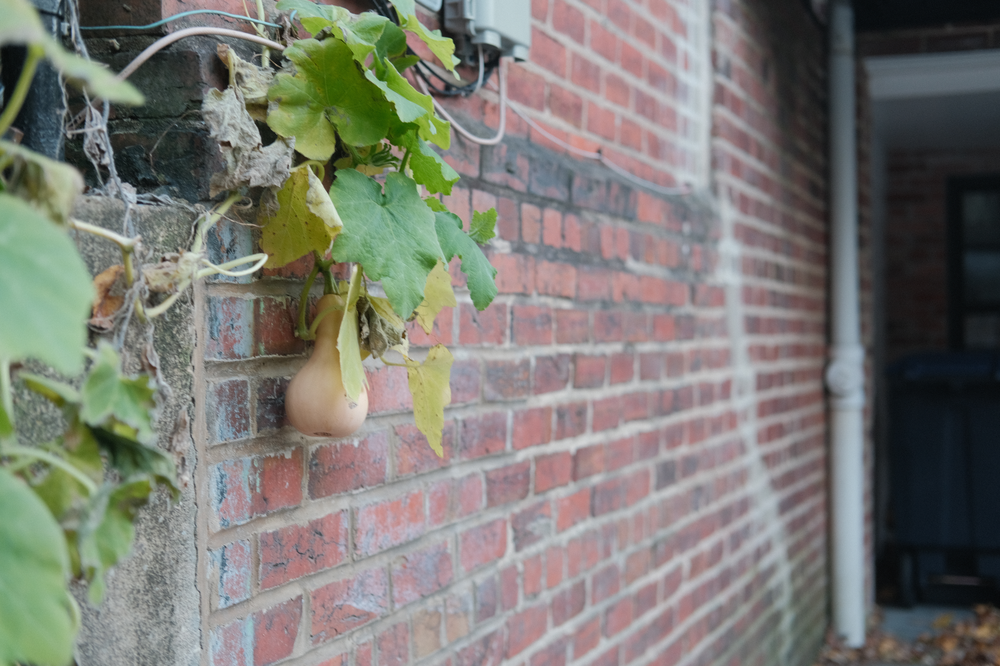
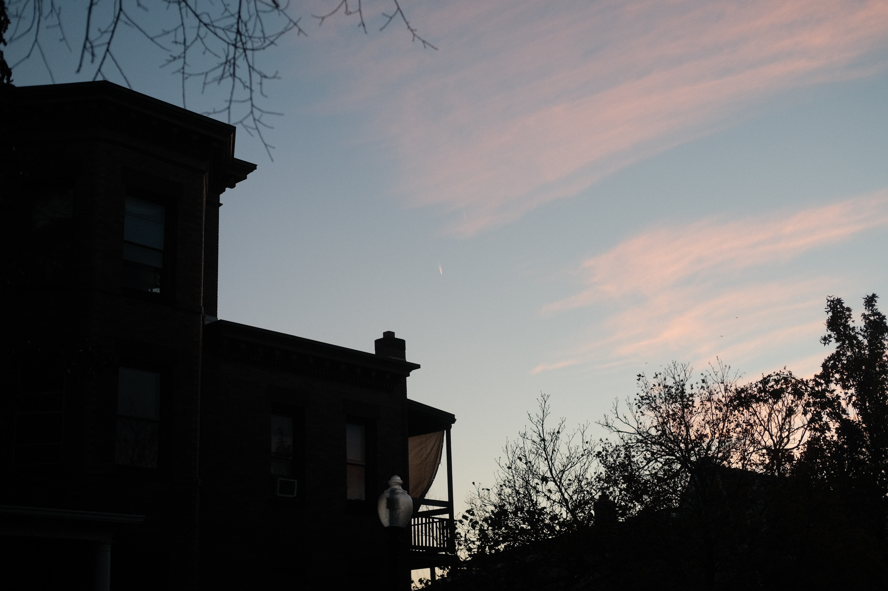
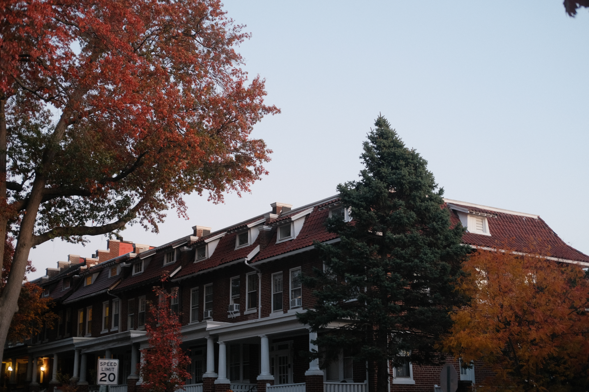
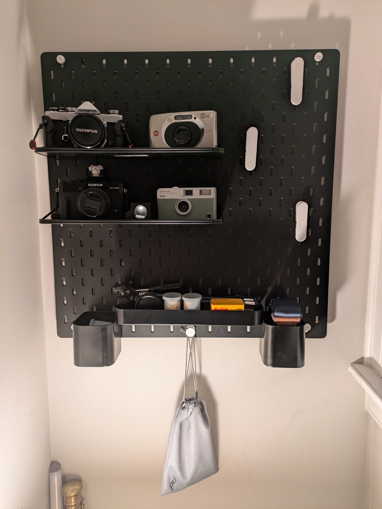
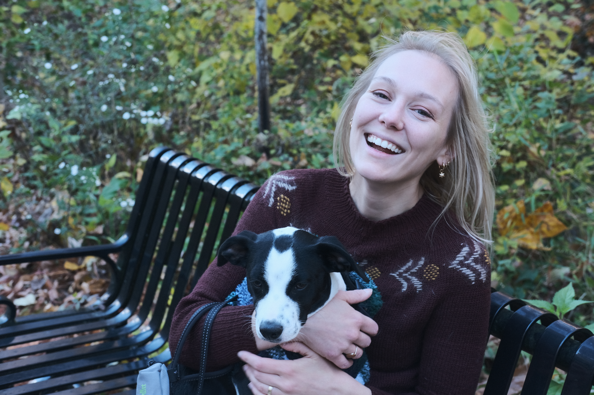

+++
date = '2025-11-16T18:21:45-05:00'
draft = false
title = 'Pizza and Passion'
+++

## Oh Yes it's pizza night, and the feeling's right

Two weeks since my last post. Last Saturday I sprained my wrist in a soccer game which was a poor way to kick off the weekend, but I had a little pizza night with Troy and Zoe.

_A little Mediterranean influenced pizza_

Zoe and I had just done Cava-esque bowls for dinner the week prior to this pizza night, so I had a little shawarma spice mix in the cabinet. I thought it would be nice to use it, as well as some leftovers from those bowls. We ended up with a white and red pie both topped with:

Mozzarella
Feta
Mizuna (Japanese mustard greens)
Shawarma spiced mushrooms (which also got hit with some soy sauce)
Pickled red onions

This was a really phenomenal combo, but what really put it over the edge was a white sauce from the halal place I occasionally get takeout from. We had gotten gyros for lunch, and ended up using the white sauce as a topping for the pizza. Wow, incredible stuff. I did want to highlight the overexposure on the pizza photo here. I’ve been learning recently that I’ve probably been pushing the exposure on a lot of my stuff a little too bright at times. I think my challenge for the next few months is either exposing correctly or slightly underexposing. I realized some things about my camera that should have been obvious, like using the exposure compensation meter correctly. I’m hoping to see future shots that aren’t so WHITE.

We also had a viewing of Boy and the Heron. This was the eleventh movie in the Ghibli series that Zoe and I have done this year. We’ve done the Miyazaki movies chronologically, and we’ve also done one Wes Anderson film per month, but those are sorted by vibe. We watched the dub of Boy and the Heron, since I had only seen it once before in the theater in Japanese. I really enjoyed the dub, and I felt like it made it easier to connect with the more esoteric subject matter. The Wind Rises was easy to consume, and perhaps more enjoyable to consume in Japanese, but for a straight fantasy like Boy and the Heron, I thought the dub was great.

I had more to say on the film on [Letterboxd](https://boxd.it/bENS9x)

It’s been getting colder over the last few weeks (maybe the impetus for a cozy pizza night), and Zoe and I did a short walk with Poppy on November 5th. I took some photos that felt like autumn in Mt. Pleasant.

It’s fun to use Poppy as an excuse to do small photo walks in the neighborhood. I have been fascinated by the Autumn light lately, and had been wanting to capture some of that essence. It’s getting harder to hit a nice golden hour walk after the clocks changed, but it’s still beautiful outside.

I finished last weekend with a nice Pathfinder game at Goose’s. He made a delicious chili con carne, and we enjoyed a selection of wine from the huge wine collection that he and Kylie have suddenly inherited.

This past week I reorganized and revamped my flickr which I think is worth checking out!

[My Flickr](https://www.flickr.com/people/crwayman/)

This weekend was nice and jam packed. I took the new Olympus down to Georgetown waterfront to get some photos. It was a bit overcast and the light was very diffuse. It’s difficult to adjust to using a light meter. I missed an incredible opportunity to shoot a ten or twelve point buck walking through Rock Creek behind the zoo because I was desperately trying to figure out the right exposure to capture the shot. I think it really illuminated the hoops I’ll need to jump through to catalog my days in the way that I have lately with digital photography. I only shot about a third of the roll, but hopefully soon I’ll finish it and get it developed along with some of the other rolls I’ve had sitting around and share some cool stuff.

After that I had a bit of a “showcase day.” Goose performed improv at Sitar Arts Center in Kalorama. It was a nice performance space, and his group was great! Very funny, and it’s amazing how confident they were as level one improvisers. We hit Green Zone in Adams Morgan for celebratory drinks and I found out how great the fries are there. Perry and Alex came back with Zoe and I and we watched Clue and ate Chinese food from Shanghai Dumpling in Petworth. We ended showcase day by watching Alex perform a DJ set at Jimmy Valentine’s in Trinidad, which was a treat.

It’s nice to be part of a community of people that is excited about finding their joy. It feels special to know people that are willing to perform, try a new art, or pursue something that excites them. It’s good to stop and appreciate how lucky I am to have such a vibrant community.

Today I built IKEA furniture, setting up a nice camera shrine for my gear.

_A new SKADIS board from IKEA to house all of my stuff_

We’ve been trying to declutter our shelves a bit lately by improving our storage and I’m a big fan of this set up! I want to hang some prints from those clips. I got some fun shots ordered today to display.

We took Poppy for a walk to Klingle Trail and took some photos for our holiday cards. Which was fun. I think the cards will come out nicely. Here’s a little BTS shot.

_Beautiful!_

That’s all for now.

-C
